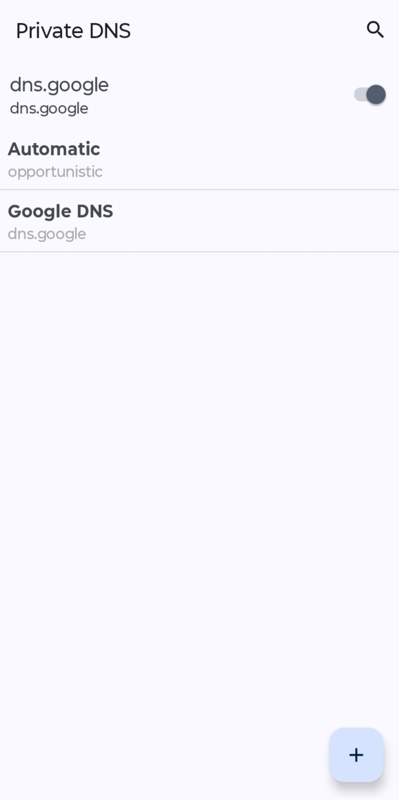
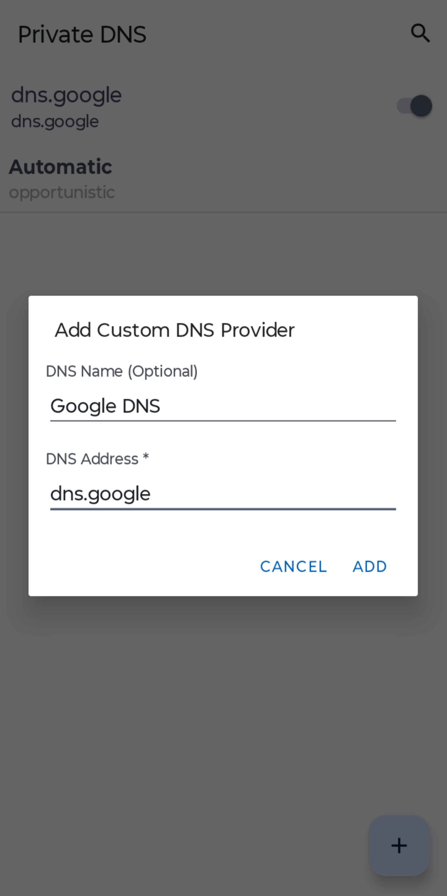
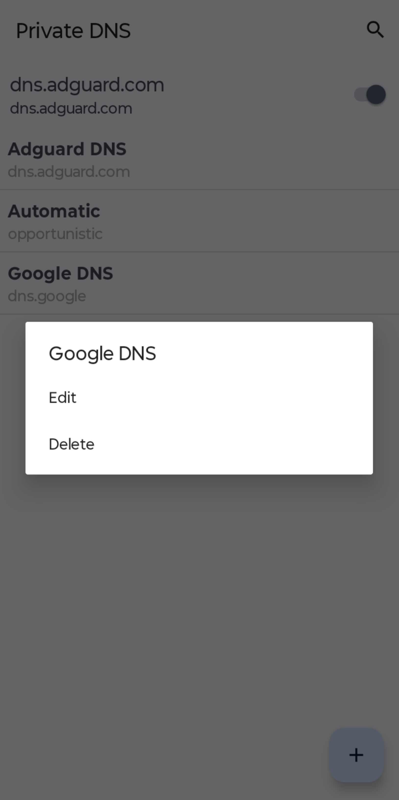
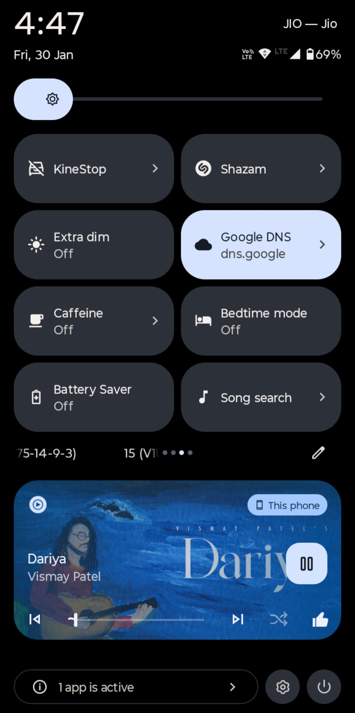
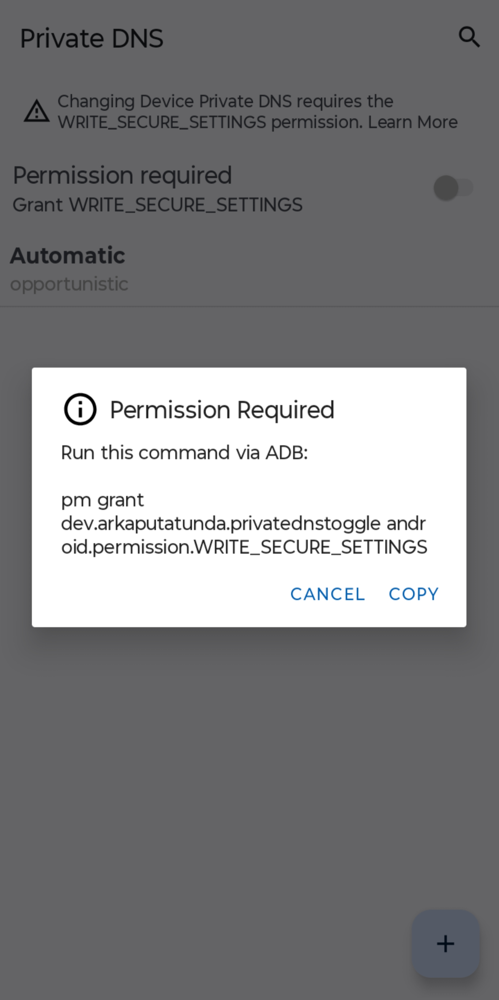

# Private DNS

A simple, lightweight Android app that lets you **toggle & manage the in-built Private DNS (DNS over TLS) settings** on your device with ease without digging through system settings every time.

## 📥 Download

## 🖼️ Screenshots

## 📱 Requirements

- Android **9 (API 28)** or higher
- android.permission.WRITE_SECURE_SETTINGS (instructions provided in the app)

## 🌍 Example DNS Providers

You can use providers like:
- `dns.google`
- `cloudflare-dns.com`
- `dns.adguard.com`
- Any valid DNS-over-TLS hostname

*(You are free to use any provider you trust.)*

Built with ❤️ for Android users who care about privacy. If you like this project, consider starring the repository!
